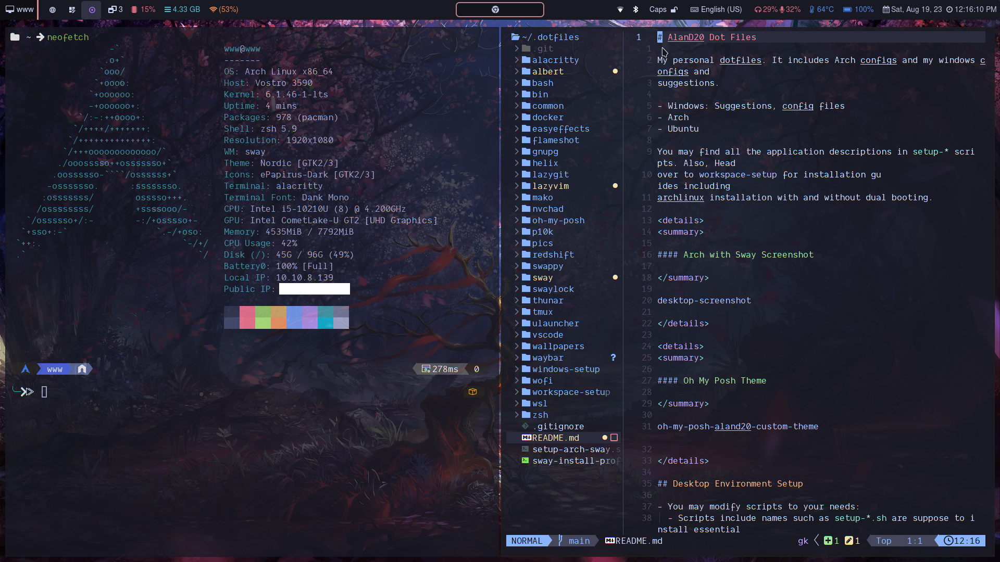
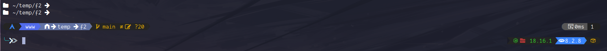

# AlanD20 Dot Files

My personal dotfiles. It includes Arch configs and my windows configs and
suggestions.

- Windows: Suggestions, config files
- Arch
- Ubuntu

You may find all the application descriptions in `setup-*` scripts. Also, Head
over to [workspace-setup](workspace-setup/) for installation guides including
archlinux installation with and without dual booting.

<details>
<summary>

#### Arch with Sway Screenshot

</summary>



</details>

<details>
<summary>

#### Oh My Posh Theme

</summary>



</details>

## Desktop Environment Setup

- You may modify scripts to your needs:
  - Scripts include names such as `setup-*.sh` are suppose to install essential
    apps and configure the system workspace.
  - Scripts include names such as `*-install-profile.zsh` are intended to be
    installed with user privileges. They will configure the user workspace and
    it copies user configurations.

## Nvidia Drivers

Take a look at this repo to
[install nvidia drivers on arch](https://github.com/korvahannu/arch-nvidia-drivers-installation-guide).

After installing the nvidia drivers, use hyprland guide on Nvidia drivers to also finish some additional configuration if you still have issues with screen flickering or nvidia drivers aren't being used properly, [Hyprland Guide on Nvidia](https://wiki.hyprland.org/hyprland-wiki/pages/Nvidia/)

- With sway, use vulkan renderer, for that, you may have to install `vulkan-intel` and `vulkan-validation-layers`.
- Brightnessctl not working properly on nvidia drivers? Try to add `acpi_backlight=native` to `GRUB_CMDLINE_LINUX_DEFAULT` in `/etc/default/grub`. (Don't forget to do `sudo grub-mkconfig -o /boot/grub/grub.cfg` after changes.)
- Don't forget to Enable this kernel module parameter for nvidia: [Preserve Video Memory After Suspend](https://wiki.archlinux.org/title/NVIDIA/Tips_and_tricks#Preserve_video_memory_after_suspend)

## Enable SSH-Agent

```bash
# Make sure to add your private key to `ssh-agent`
ssh-add <path/to/private/key>

# Check currently loaded private keys
ssh-add -l

# Auto-start/Enable ssh-agent service
systemctl --user enable --now ssh-agent.service
```

## Database & Email With Docker

Checkout [docker/docker](docker/docker) directory to quickly setup database and
a testing email service with a single command.

You may configure the docker-compose file to your needs.

## Screen Sharing on Wayland

To share your screen on Wayland, install
`sudo pacman -Sy obs-studio xdg-desktop-portal-wlr` then use `pipewire` window
capture to share your screen.

## Chrome Flags

Make sure to enable the following flags for Chromium

- WebRTC PipeWire support: Enabled
- Preferred Ozone platform: Wayland or Xorg
- Parallel Downloading: Enabled
- Tab Groups Save and Sync: Enabled

---

## Resources & Troubleshooting

- Want to install another desktop/window environment? Take a look at
  [archinstall profiles](https://github.com/archlinux/archinstall/tree/master/archinstall/default_profiles).
  It's a good start to install necessary packages for each environment.
- Licensed fonts such as `Dank Mono`.
- ZSH Plugin Descriptions
  - `zsh-nvm` plugin installs `nvm`.
- Find WSL IP address for SSH access:

  ```bash
  ip addr | grep eth0
  ```

- if for some reason you are stuck on window manager, you always have the
  ability to switch to `tty` using `Ctrl + Alt + f2` shortcut. You may switch to
  several `tty` by using `Ctrl + Alt + f2`, `Ctrl + Alt + f3`,
  `Ctrl + Alt + f4`, , and so on.
- To find font names, you may use `fc-list` with grep to filter out your font.

  ```bash
  fc-list | grep -i meslolgmnerd
  ```

- To copy output or input to clipboard use `xclip` for Xorg and `wl-copy`
  (install `wl-clipboard`) for Wayland.
- **[A2DP Bluetooth Arch Wiki](https://wiki.archlinux.org/title/bluetooth_headset)**
  - enable Secure Simple Pairing (SSP) mode to avoid manual pin authentication for bluetooth connections
    ```bash
    sudo btmgmt ssp on
    ```
- Here are a few documentations to enable Dark mode:
  - **[Switching Dark Mode Wiki](https://wiki.archlinux.org/title/Dark_mode_switching)**
  - **[GTK Configuration](https://wiki.archlinux.org/title/GTK#Configuration)**
  - **[Enable on Swaywm](https://github.com/swaywm/sway/wiki/GTK-3-settings-on-Wayland)**
- After rebooting, unable to connect to internet? Sometimes, both `dhcpcd` and
  `NetworkManager` conflict with each other, as a result, it fails to connect to
  internet. There are several ways to go about it: (1) Restarting your computer
  (2) Stopping `dhcpcd` service then restart `NetworkManager` service, after
  that, start `dhcpcd` service again. This should solve the problem.
- If you have issues with `shared lib** is not found`, you might already have the library but a newer version instead while the package might require an older version. You may check the `/usr/lib` if that library exist, if so, you may create a symbolic link pointing the required library version to the latest version.
- Looking for TUI apps? Take a look at [toolleeo/Awesome list](https://github.com/toolleeo/cli-apps) or [rothgar/Awesome TUIs](https://github.com/rothgar/awesome-tuis)
