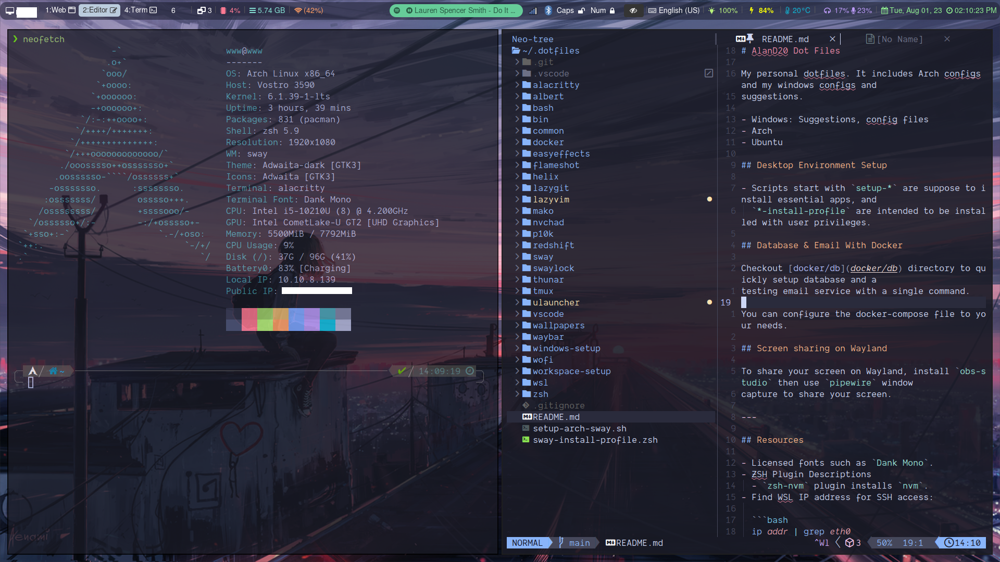

# AlanD20 Dot Files

My personal dotfiles. It includes Arch configs and my windows configs and
suggestions.

- Windows: Suggestions, config files
- Arch
- Ubuntu

- You may find all the application descriptions in "setup-\*" scripts.
- Head over to [workspace-setup](workspace-setup/) for installation guides
  including archlinux installation with and without dual booting.



## Desktop Environment Setup

- Scripts start with `setup-*` are suppose to install essential apps, and
  `*-install-profile` are intended to be installed with user privileges.

## Database & Email With Docker

Checkout [docker/db](docker/db) directory to quickly setup database and a
testing email service with a single command.

You can configure the docker-compose file to your needs.

## Screen sharing on Wayland

To share your screen on Wayland, install `obs-studio` then use `pipewire` window
capture to share your screen.

---

## Resources

- Licensed fonts such as `Dank Mono`.
- ZSH Plugin Descriptions
  - `zsh-nvm` plugin installs `nvm`.
- Find WSL IP address for SSH access:

  ```bash
  ip addr | grep eth0
  ```

- if for some reason you are stuck on window manager, you always have the
  ability to switch to `tty` using `Ctrl + Alt + f2` shortcut. You may switch to
  several `tty` by using `Ctrl + Alt + f2`, `Ctrl + Alt + f3`,
  `Ctrl + Alt + f4`, , and so on.
- To find font names, you may use `fc-list` with grep to filter out your font.

  ```jsx
  fc-list | grep -i meslolgmnerd
  ```

- To copy output or input to clipboard use `xclip` for Xorg and `wl-copy`
  (install `wl-clipboard`) for Wayland.
- **[A2DP Bluetooth Arch Wiki](https://wiki.archlinux.org/title/bluetooth_headset)**
- Here are a few documentations to enable Dark mode:
  - **[Switching Dark Mode Wiki](https://wiki.archlinux.org/title/Dark_mode_switching)**
  - **[GTK Configuration](https://wiki.archlinux.org/title/GTK#Configuration)**
  - **[Enable on Swaywm](https://github.com/swaywm/sway/wiki/GTK-3-settings-on-Wayland)**
- After rebooting, unable to connect to internet? Sometimes, both `dhcpcd` and
  `NetworkManager` conflict with each other, as a result, it fails to connect to
  internet. There are several ways to go about it: (1) Restarting your computer
  (2) Stopping `dhcpcd` service then starting it again should solve the problem.
