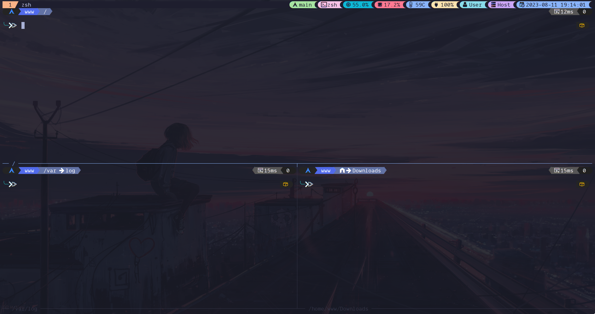

# tmux Config

- Some of the configuration comes from
  [gpakosz](https://github.com/gpakosz/.tmux)
- Checkout [awesome-tmux](https://github.com/rothgar/awesome-tmux) repository
  for more about tmux & plugins.
- Color problems?
  [Check out these solutions](https://gist.github.com/bbqtd/a4ac060d6f6b9ea6fe3aabe735aa9d95)
- [Tmux Shortcuts Cheatsheet](https://tmuxcheatsheet.com/)

#### tmux Theme

## Setup

If you are using Catppuccin Theme, you have to manually copy the modules into
`plugins/tmux/custom`.

**Tips**

- You may use `M` for Meta/Alt key and `C` indicating Control key. Also, `BTab`
  indicates Backtab key or Shift+Tab key.
- Any binding with uppercase character indicates holding Shift key before
  pressing the character.
- `-n` indicates a binding without a prefix.
- `-r` indicates a binding can be repeated, the timeout is set with
  `repeat-time`.
- `-g` indicates an option is set globally to all sessions, windows, and panes.
- `-s` indicates set an option for current session.

**Default Shortcuts:**

**General**

- <kbd>Ctrl</kbd> + <kbd>b</kbd> or <kbd>a</kbd>: Enable tmux prefix mode.

**Session**

- `prefix` + <kbd>Ctrl</kbd> + <kbd>c</kbd>: Create a new unnamed session.
- `prefix` + <kbd>C</kbd>: Create a new named session.
- `prefix` + <kbd>w</kbd>: List & Preview opened sessions.
- `prefix` + <kbd>s</kbd>: List opened sessions.
- `prefix` + <kbd>d</kbd>: Detach from current session.

**Window**

- `prefix` + <kbd>c</kbd>: Create a new window.
- <kbd>Alt</kbd> + <kbd>H</kbd>: Go to next window.
- <kbd>Alt</kbd> + <kbd>L</kbd>: Go to previous window.

**Pane**

- `prefix` + <kbd>x</kbd>: Terminate currently focused tmux pane.
- `prefix` + <kbd>"</kbd> or <kbd>-</kbd>: Create a new horizontal pane.
- `prefix` + <kbd>%</kbd> or <kbd>\_</kbd>: Create a new vertical pane.
- `prefix` + <kbd>h/j/k/l</kbd>: Move focus to another pane.
- `prefix` + <kbd>H/J/K/L</kbd>: Resize current pane.
- `prefix` + <kbd>z</kbd> or <kbd>M</kbd>: Maximize currently focused pane.
- `prefix` + <kbd>!</kbd>: Pin currently focused pane.
- `prefix` + <kbd>,</kbd>: Rename current pane.
- `prefix` + <kbd>.</kbd>: Move current pane to another session.
- `prefix` + <kbd><</kbd> or <kbd>{</kbd>: Move current pane to left.
- `prefix` + <kbd>></kbd> or <kbd>}</kbd>: Move current pane to right.
- `prefix` + <kbd>q</kbd>: Move focus to another pane.

**Plugins**

- `prefix` + <kbd>I</kbd>: Install plugins.
- `prefix` + <kbd>U</kbd>: Update plugins.
- `prefix` + <kbd>R</kbd>: Reload tmux.
- `prefix` + <kbd>Ctrl</kbd> + <kbd>s</kbd>: Saves current session using
  resurrect.
- `prefix` + <kbd>Ctrl</kbd> + <kbd>r</kbd>: Restores previous session using
  resurrect.
- `prefix` + <kbd>O</kbd>: fzf list with all captured url in the terminal.

## OhMyZsh tmux Plugin For Alias

- [Read the plugin's README file](https://github.com/ohmyzsh/ohmyzsh/tree/master/plugins/tmux)

| Alias      | Command                    | Description                                              |
| ---------- | -------------------------- | -------------------------------------------------------- |
| `ta`       | tmux attach -t             | Attach new tmux session to already running named session |
| `tad`      | tmux attach -d -t          | Detach named tmux session                                |
| `ts`       | tmux new-session -s        | Create a new named tmux session                          |
| `tl`       | tmux list-sessions         | Displays a list of running tmux sessions                 |
| `tksv`     | tmux kill-server           | Terminate all running tmux sessions                      |
| `tkss`     | tmux kill-session -t       | Terminate named running tmux session                     |
| `tmux`     | `_zsh_tmux_plugin_run`     | Start a new tmux session                                 |
| `tmuxconf` | `$EDITOR $ZSH_TMUX_CONFIG` | Open .tmux.conf file with an editor                      |

## fzf Session Switch

- [Read more](https://github.com/thuanOwa/tmux-fzf-session-switch)

- **Alias:**
  - `prefix` + <kbd>Ctrl</kbd> + <kbd>f</kbd>: To open session switcher with
    fzf.

## Tmux Sessionist

- [Read more about Tmux Sessionist](https://github.com/tmux-plugins/tmux-sessionist)

- **Aliases:**
  - `prefix` + <kbd>g</kbd> - prompts for session name and switches to it.
    Performs 'kind-of' name completion. Faster than the built-in `prefix` +
    <kbd>s</kbd> prompt for long session lists.
  - `prefix` + <kbd>C</kbd>` (shift + c) - prompt for creating a new session by
    name.
  - `prefix` + <kbd>X</kbd>` (shift + x) - terminate current session without
    detaching tmux.
  - `prefix` + <kbd>S</kbd>
    `(shift + s) - switches to the last session. The same as built-in`prefix` +
    <kbd>L</kbd> that everyone seems to override with some other binding.
  - `prefix` + <kbd>@</kbd> - promote current pane into a new session. Analogous
    to how `prefix` + <kbd>!</kbd> breaks current pane to a new window.
  - `prefix` + <kbd>t</kbd><secondary-key> - join currently marked pane
    (`prefix` + <kbd>m</kbd>) to current session/window, and switch to it
    - secondary-keys
      - <kbd>h</kbd>, <kbd>-</kbd>, <kbd>"</kbd>: join horizontally
      - <kbd>v</kbd>, <kbd>|</kbd>, <kbd>%</kbd>: join vertically
      - <kbd>f</kbd>, <kbd>@</kbd>: join full screen
